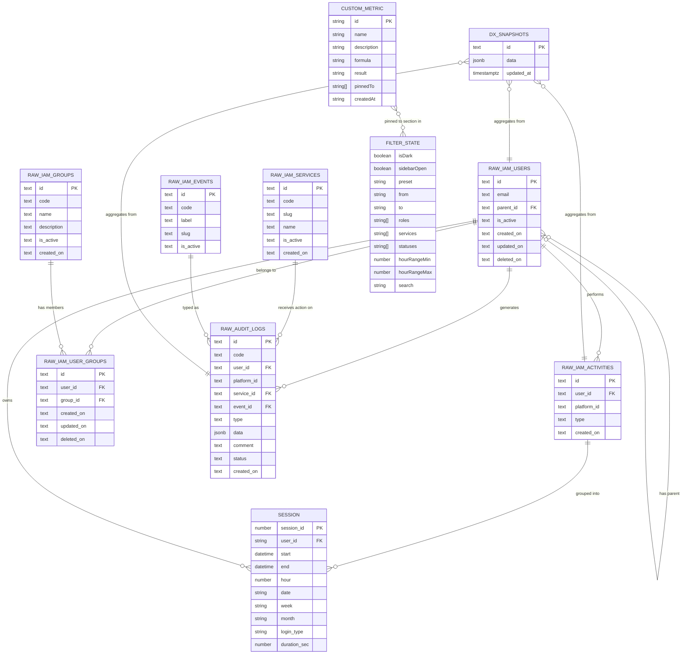

# GrayQuest IAM Dashboard — Entity Relationship Diagram

> Paste into https://mermaid.live to render.  
> Every entity maps 1:1 to a table defined in PRD Section 7.  
> Every attribute listed in Section 7 appears below.  
> Every foreign key relationship appears as a labelled line.

---

## Relationship Legend

| Entity A | Relationship | Entity B | Cardinality | FK Column |
|----------|-------------|----------|------------|-----------|
| RAW_IAM_USERS | performs | RAW_IAM_ACTIVITIES | One user → many activities | RAW_IAM_ACTIVITIES.user_id → RAW_IAM_USERS.id |
| RAW_IAM_USERS | belongs to | RAW_IAM_USER_GROUPS | One user → many group memberships | RAW_IAM_USER_GROUPS.user_id → RAW_IAM_USERS.id |
| RAW_IAM_GROUPS | has members | RAW_IAM_USER_GROUPS | One group → many memberships | RAW_IAM_USER_GROUPS.group_id → RAW_IAM_GROUPS.id |
| RAW_IAM_USERS | generates | RAW_AUDIT_LOGS | One user → many audit log entries | RAW_AUDIT_LOGS.user_id → RAW_IAM_USERS.id |
| RAW_IAM_SERVICES | receives action on | RAW_AUDIT_LOGS | One service → many audit log entries | RAW_AUDIT_LOGS.service_id → RAW_IAM_SERVICES.id |
| RAW_IAM_EVENTS | typed as | RAW_AUDIT_LOGS | One event type → many audit log entries | RAW_AUDIT_LOGS.event_id → RAW_IAM_EVENTS.id |
| RAW_IAM_USERS | has parent | RAW_IAM_USERS | One user → optional parent user (self-ref) | RAW_IAM_USERS.parent_id → RAW_IAM_USERS.id |
| RAW_IAM_ACTIVITIES | grouped into | SESSION | Many activities → one session (computed) | SESSION.user_id → RAW_IAM_USERS.id |
| RAW_IAM_USERS | owns | SESSION | One user → many sessions | SESSION.user_id → RAW_IAM_USERS.id |
| DX_SNAPSHOTS | aggregates from | RAW_IAM_USERS | Many snapshots ← many raw users (ETL) | Logical only (compute pipeline) |
| DX_SNAPSHOTS | aggregates from | RAW_AUDIT_LOGS | Many snapshots ← many audit logs (ETL) | Logical only (compute pipeline) |
| DX_SNAPSHOTS | aggregates from | RAW_IAM_ACTIVITIES | Many snapshots ← many activities (ETL) | Logical only (compute pipeline) |
| CUSTOM_METRIC | pinned to section in | FILTER_STATE | Many metrics ↔ many sections (array field) | CUSTOM_METRIC.pinnedTo (string array of section names) |

---

## Notes on Diagram Design

1. **SESSION** is an in-process computed entity, not persisted to any database table. It is included because it is a first-class structural concept in the compute pipeline and drives session-related KPIs (cross-module rate, completion rate, duration).

2. **DX_SNAPSHOTS** is a single physical table with `id` as the discriminator. Each row holds a different dataset (e.g., id='overview', id='users'). The diagram shows it as a single entity; in practice it functions as 13 virtual typed views distinguished by the `id` string.

3. **CUSTOM_METRIC** and **FILTER_STATE** are client-only entities stored in the browser (localStorage / Zustand). They have no Supabase representation. Their relationship to FILTER_STATE is semantic: a metric's `pinnedTo` array contains Section values that match the sections managed by FILTER_STATE.

4. **platform_id** appears in both RAW_IAM_ACTIVITIES and RAW_AUDIT_LOGS as a text column used as a filter key. It is not a foreign key to a platforms table — no such table exists in the schema. All data for platform_id='6' is included; all other platform_id values are excluded during the compute join step.
